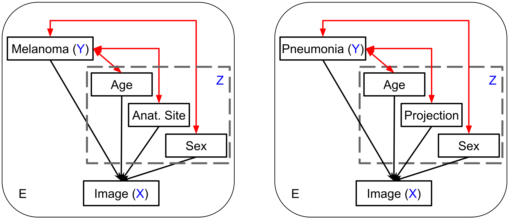

# CoPA - Conditional Prevalence-Adjustment

Healthcare data often come from multiple sites in which the correlations between the target (Y) and the confounding variables (Z) can vary widely.
If deep learning models exploit these unstable correlations, they might fail catastrophically in unseen sites.
CoPA achieves good predictive performance in unseen sites by adjusting for the effect of unstable correlations through the conditional prevalence estimate.



Link to paper: [Robust Learning via Conditional Prevalence Adjustment](https://arxiv.org/abs/2310.15766)

## How to Setup

1. Install [*miniconda*](https://docs.conda.io/projects/miniconda/en/latest/miniconda-install.html)
2. Setup the conda environment
```
    conda env create -n copa -f environment.yml
```

## How to Use

1. Activate the conda environment
2. Execute the shell scripts in the `examples` folder. 
3. For ISIC experiment, see the instruction in the `data/ISIC` folder.
4. For chest X-Ray experiment, download the data from [PhysioNet](https://physionet.org/).

## Cite

```
@inproceedings{nguyen2024robust,
    title={{Robust Learning via Conditional Prevalence Adjustment}},
    author={Nguyen, Minh and Wang, Alan Q., and Kim, Heejong and Sabuncu, Mert R.},
    booktitle={Proceedings of WACV},
    year={2024}
}
```
